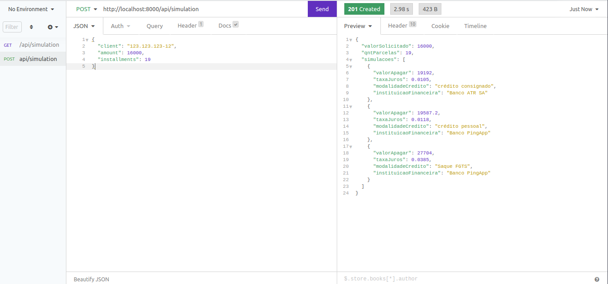

<p align="center"><a href="https://laravel.com" target="_blank"></a></p>


# Teste Go Sat

**Descrição:** O teste tem como objetivo validar os conhecimentos técnicos em PHP + Laravel;

**Pessoa avaliada:** [Maria Baeta](https://github.com/mariabaeta27);

**Stacks:** PHP, Composer, Laravel, SQlite, Swagger;

**Desafio:** Desenvolver uma API para consultar a disponibilidade de crédito para um determinado CPF e informar qual é a melhor oportunidade a ser ofertada.
<br/>
*Observação: Foi disponibilizado uma API para consulta dos dados necessários para realização da tarefa.*

## **Requisitos:**

- Obrigatórios:
  - [x] Utilizar o Swagger, Postman ou alguma ferramenta similar para documentar suas rotas;
  - [x] Entregue uma documentação com todos os passos para executar seu projeto;
  - [x] Utilizar banco de dados para persistir os dados gerados durante o teste;
  - [x] Crie uma rota (endpoint) para receber qual CPF será consultado.

    ```bash
      CPFs Disponíveis:
      111.111.111-11
      123.123.123.12
      222.222.222.22
    ```

  - [ ] Desenvolver algum relatório gráfico fazendo uso linguagens e ferramentas Front-end;

- Opcionais:
  - [ ] Disponibilizar o teste na internet, para que possa ser testado via navegador ou Postman.

## Retorno da API:

Selecione até 3 ofertas de crédito e ordene-as da mais vantajosa a menos vantajosa para o cliente. Para cada oferta de crédito selecionada deve-se aplicar lógicas (manipulação de estruturas de dados, realização de cálculos, etc) de forma que a oferta contenha as seguintes informações:

 ```bash
    instituicaoFinanceira;
    modalidadeCredito;
    valorAPagar;
    valorSolicitado;
    taxaJuros;
    qntParcelas
  ```

## Setup dp projeto

- **Importante:**

- Baixe o repositório [Git](https://github.com/mariabaeta27/api-go-sat)
- Acesso a pasta do projeto
- *Importante!!!:* Verifiquei se tem o PHP e o Composer instalados.

```bash

php -v

composer --version

```

Em caso de já os ter instalados no terminal terá o retorno da versão, ao como:

```bash

PHP 8.1.2-1ubuntu2.14 (cli) (built: Aug 18 2023 11:41:11) (NTS)
Copyright (c) The PHP Group
Zend Engine v4.1.2, Copyright (c) Zend Technologies
    with Zend OPcache v8.1.2-1ubuntu2.14, Copyright (c), by Zend Technologies
PHP 8.1.2-1ubuntu2.14 (cli) (built: Aug 18 2023 11:41:11) (NTS)

Copyright (c) The PHP Group
Zend Engine v4.1.2, Copyright (c) Zend Technologies
    with Zend OPcache v8.1.2-1ubuntu2.14, Copyright (c), by Zend Technologies

```

Caso não os tenha instalados você pode verificar o passo a passo na documentação do [Laravel](https://laravel.com/)

## Instale as dependências

```bash

composer install

```

## Crie um arquivo de configuração de ambiente e gere a chave do aplicativo

```bash

cp .env.example .env
php artisan key:generate

```

## Crie o banco de dados

```bash

php artisan migrate

```

## Inicie o servidor

```bash

php artisan serve

```

## Rotas disponíveis:

Após iniciar o servidor acesse a rota a seguir para ter acesso a documentação no Swagger: 

```bash

http://localhost:8000/api/documentation 

```

## Realizando requisições a API:

Utilizando o Client API de sua preferencia (Insomnia) utilize as cUrl para realizar as requisições a api:

**Método Post**

```bash

  POST        api/simulation (Criação de simulação)
  curl --request POST \
  --url <http://localhost:8000/api/simulation> \
  --header 'Content-Type: application/json' \
  --data '{
 "client": "123.123.123-12",
 "amount": 16000,
 "installments": 19
}'

```

**Método Get**

```bash

 GET|HEAD    api/simulation (Lista de simulações)
  ccurl --request GET \
  --url http://localhost:8000/api/simulation

```
## Retorno api

### Método Post


